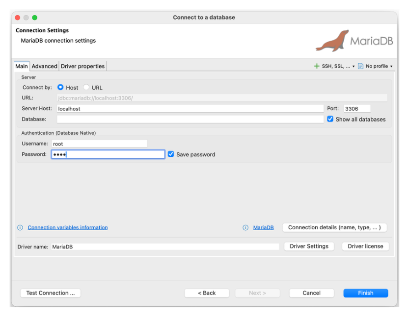
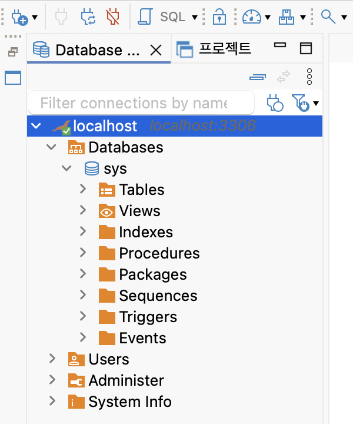

# 데이터베이스 기초 교육

## 환경 구성하기

- [docker 알아보기](https://github.com/ESG-EDU/Docs/tree/main/docker)
- [docker container 만들기](https://hub.docker.com/_/mariadb)

```bash
docker run -d -p 3306:3306 -e MARIADB_ROOT_PASSWORD=1234 --name mariadb mariadb:latest
```

- [DBeaver 설치](https://dbeaver.io/)

> 접속 정보 입력 및 접속 테스트 화면



> 접속 완료 화면




## (1) 관계형 데이터베이스의 핵심 개념

### ✔ 테이블(Table)

* 데이터를 저장하는 기본 단위
* 행(Row, 튜플)과 열(Column, 속성)으로 구성됨

예)

| id | name | age |
| -- | ---- | --- |
| 1  | Kim  | 30  |

### ✔ 관계(Relation)

- 각 테이블은 서로 `키(key)`를 통해 연결될 수 있음
- 예) 주문 테이블(order)이 고객 테이블(customer)의 customer_id를 참조

### ✔ 스키마(Schema)

데이터베이스의 **구조 정의서**

* 테이블 이름
* 컬럼 이름·타입
* 제약 조건 등

## 📌 2. 주요 키(Key) 개념

### ✔ 기본키(Primary Key)

* 각 행을 고유하게 식별하는 키
* 중복 X, NULL X

### ✔ 외래키(Foreign Key)

* 다른 테이블의 기본키를 참조하는 컬럼
* 테이블 간의 관계를 표현

### ✔ 후보키(Candidate Key)

* 기본키가 될 수 있는 컬럼들

### ✔ 복합키(Composite Key)

* 여러 컬럼을 조합해 하나의 기본키 역할 수행

## 📌 3. RDB의 3가지 대표 연산 (관계 대수)

### ✔ SELECT — 튜플 선택

조건에 맞는 행 선택
```
예) age > 30
```

### ✔ JOIN — 테이블 결합

두 테이블을 연결해 데이터를 조회

## 📌 4. 관계형 데이터베이스의 특징

### ✔ 1. 구조적 데이터 저장

정해진 스키마에 따라 엄격한 구조 유지

### ✔ 2. ACID 트랜잭션 보장

* **A**tomicity (원자성)
* **C**onsistency (일관성)
* **I**solation (고립성)
* **D**urability (지속성)

안정성과 신뢰성이 매우 높음.

### ✔ 3. SQL을 이용한 표준화된 접근

데이터 조작 언어가 표준화되어 있음(SQL)

### ✔ 4. 관계 기반 조인 지원

여러 테이블을 연결해 다차원적 분석 가능

## 📌 5. 관계형 데이터베이스의 장단점

### 👍 장점

* 강력한 데이터 무결성
* 복잡한 쿼리 및 조인 가능
* 트랜잭션 처리에 강함
* 표준 SQL 사용으로 호환성 높음

### 👎 단점

* 스키마 변경이 어려움 (유연성 부족)
* 수평 확장(Sharding) 어려움
* 비정형 데이터 처리 능력 부족

## 📌 6. 주요 RDBMS 제품

| 제품                       | 설명                |
| ------------------------ | ----------------- |
| **MySQL**                | 가장 널리 사용되는 오픈소스   |
| **PostgreSQL**           | 규격 준수, 확장성 뛰어남    |
| **Oracle DB**            | 엔터프라이즈 환경에 강함     |
| **Microsoft SQL Server** | 윈도우 기반 기업에서 많이 사용 |
| **MariaDB**              | MySQL의 포크         |

## 📌 7. NoSQL vs RDB 비교

| 항목     | RDB           | NoSQL            |
| ------ | ------------- | ---------------- |
| 데이터 구조 | 고정된 스키마       | 유연한 스키마          |
| 확장성    | 수직 확장 중심      | 수평 확장 용이         |
| 트랜잭션   | 강력 (ACID)     | 일반적으로 약함         |
| 사용 예   | 금융, ERP, 주문관리 | 로그, SNS, 실시간 시스템 |

## 📌 8. 언제 RDB를 사용해야 할까?

- 데이터가 명확한 구조를 가지고 있을 때
- 데이터 무결성이 중요할 때
- 복잡한 조인이 필요할 때
- 트랜잭션 안정성이 중요한 서비스
