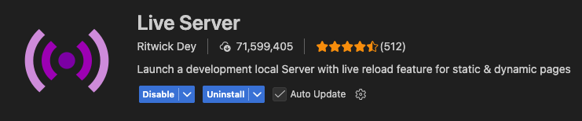
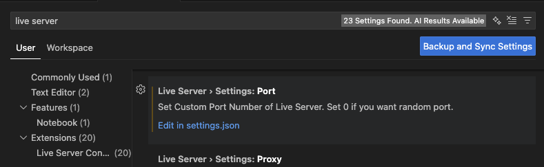
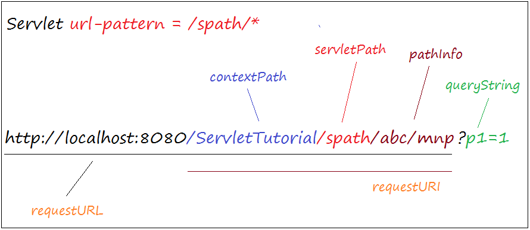

# UI 기초 교육

## 개발 환경

> 1. web server 설치

- [Live Server](https://marketplace.visualstudio.com/items?itemName=ritwickdey.LiveServer)



> 2. 기본포트 확인



- `Edit in settings.json` 선택

```json
"liveServer.settings.port": 80,
```

> 3. `Go Live` 실행

- [80: 서비스](http://localhost:80) 접속
- [5500: 서비스](http://localhost:5500) 접속

### URL 패턴 알아보기



- `http`(HyperText Transfer Protocol): [W3](https://ko.wikipedia.org/wiki/%EC%9B%94%EB%93%9C_%EC%99%80%EC%9D%B4%EB%93%9C_%EC%9B%B9) 정보 공유 시스템 웹에서 정보를 주고 받을 수 있는 `통신 프로토콜`을 말합니다.
- `host` & `domain`: IP 주소를 대신하는 사람이 기억하기 쉬운 웹사이트 이름 입니다.
- `port`: 해당 domain에서 서비스 접속하는 [***TCP/UDP***](https://ko.wikipedia.org/wiki/TCP/UDP%EC%9D%98_%ED%8F%AC%ED%8A%B8_%EB%AA%A9%EB%A1%9D)의 포트 입니다.
- `contextPath`: 웹 애플리케이션의 서버 상의 상대적인 경로를 말합니다.
- `queryString`: 특정 매개변수에 값을 할당하는 [균일 자원 지시자](https://ko.wikipedia.org/wiki/URL)의 일부 입니다.

## 웹 문서 알아보기

- `html`(Hypertext Markup Language): 웹페이지의 구조를 정의하는 ***마크업 언어*** 입니다.
- `css`(Cascading Style Sheets): HTML로 작성된 웹 페이지의 디자인과 레이아웃을 꾸미는 ***스타일 시트 언어*** 입니다.
- `javascript`: 웹 페이지를 동적으로 만드는 데 사용되는 ***객체 기반 스크립트 프로그래밍 언어*** 입니다.

### Web Front End

- 사용자가 웹사이트를 사용할 때 눈으로 보거나 클릭/입력 등 상호작용하는 요소를 구현하는 기술 분야입니다.

- HTML (구조/뼈대): 웹페이지의 구조를 정의하는 역할

```html
<h1>안녕하세요.</h1>
<p>웹 프런트엔드 입니다.</p>
```

- CSS (디자인/스타일링): 색상, 크기, 레이아웃, 애님이션 등 담당

```css
h1 {
	color: blue;
	text-align: center;
}
```

- JavaScript (동작/인터랙션): 동적인 기능을 구현하는 스크립트 언어

```javascript
document.querySelector("h1").onclick = () => alert("제목 클릭!");
```

## FrameWork 알아보기

| 종류 | 설명 |
| :---: | :---: |
| **React** | 현재 가장 인기 많음. 컴포넌트 기반 UI 라이브러리 |
| **Vue.js** | 배우기 쉬움. 가볍고 유연 |
| **Angular** | 대규모 기업용 프로젝트에서 사용 |
| **Svelte / SvelteKit** | 빠르고 간단한 최신 프레임워크 |
| **Next.js** | React 기반 풀스택 프레임워크 (SSR/SEO 강함) |
| **Nuxt.js** | Vue 기반 풀스택 프레임워크 |


---

### Stack Overflow trends


2024 (july 2024, +65,000 developers): https://survey.stackoverflow.co/2024
- Popularity: `React` 39.5%, `Angular` 17.1%, `Vue.js` 15.4%, `AngularJS` 6.8%, Svelte 6.5%, Solid.js 1.2%
- Desired: `React` 33.4%, `Vue.js` 16.3%, `Angular` 13.9%, Svelte 11.5%, `AngularJS` 4.2%, Solid.js 3.6%
- Admired: Svelte 72.8%, Solid.js 67%, `React` 62.2%, `Vue.js` 60.2%, `Angular` 53.4%, `AngularJS` 23.1%

2023 (june 2023, +90,000 developers): https://survey.stackoverflow.co/2023
- Popularity: `React` 40.58%, `Angular` 17.46%, `Vue.js` 16.38%, `AngularJS` 7.21%, Svelte 6.62%, Solid.js 1.36%, Lit 0.68%
- Desired: `React` 35.25%, `Vue.js` 17.42%, Svelte 14.18%, `Angular` 13.86%, Solid.js 4.93%, `AngularJS` 4.21%, Lit 0.92%
- Admired: Svelte 74.50%, Solid.js 71.71%, `React` 63.61%, `Vue.js` 57.87%, Lit 55.71%, `Angular` 50.75%, `AngularJS` 19.22%

2022 (june 2022, +70,000 developers): https://survey.stackoverflow.co/2022
- Popularity: `React.js` 42.62%, `Angular` 20.39%, `Vue.js` 18.82%, `Angular.js` 8.99%, Svelte 4.58%
- Loved: Svelte 75.28%, `React.js` 68.19%, `Vue.js` 63.16%, `Angular` 52.27%, `Angular.js` 21.01%
- Want: `React.js` 22.54%, `Vue.js` 14.6%, `Angular` 7.18%, Svelte 9.34%, `Angular.js` 4.32%

