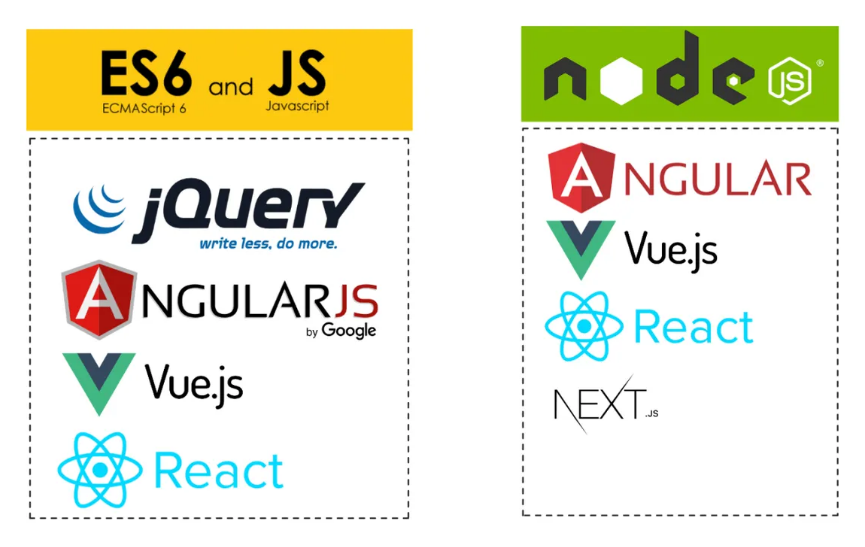

# Node.js 기초 교육

- [Node.js 알아보기](https://github.com/ESG-EDU/Docs/tree/main/node)



## ESM vs CJS

### 1. 기본 개념

| 항목 | ESM (ECMAScript Module) | CommonJS |
| :---: | :---: | :---: |
| 표준 여부 | JavaScript 공식 표준 | Node.js 고유 모듈 시스템 |
| 사용 환경 | 브라우저, Node.js(현대) | 주로 Node.js |
| 로딩 방식 | 정적 로딩 (compile-time) | 동적 로딩 (run-time) |

### 2. 문법 차이

- ESM 문법

```js
// export
export const count = 1;
export function hello() { }
export default function() { }

// import
import { count, hello } from './module.js';
import func from './module.js';
```

- CJS

```js
// export
module.exports = { count: 1, hello() {} };
exports.count = 1;

// import
const { count, hello } = require('./module');
```

### 3. 로딩 방식 (Lazy vs Static)

> ESM: 정적 분석 가능 (Static)

- import/export는 파일을 실행하기 전에 분석
- 트리 쉐이킹(tree-shaking) 가능
- 순환 참조가 보다 안전하게 처리됨

```js
import x from './file.js';
```
-> 컴파일 단계에서 모듈 의존 관계가 발견됩니다.

> CJS: 런타임 로딩 (Dynamic)

- require는 코드 실행 중 호출
- 조건부 require 가능
- 정적 분석 어려움 -> tree-shaking 불리

```js
if(condition) {
	const x = require('./file');
}
```

### 동기/비동기 로딩 차이

| 모듈 시스템   | 로딩 방식 |
| :---: | :---: |
| ESM | 비동기 로딩 가능 (특히 브라우저) |
| CommonJS | 동기 로딩 (Node.js 파일 시스템 기반) |

- 브라우저에서는 CJS를 바로 사용할 수 없습니다.
- Node.js에서는 `import()`를 통해 ESM의 동적 로딩도 가능합니다.

### 차이점 정리

| 구분 | ESM | CommonJS |
| :---: | :---: | :---: |
| 표준 | ✔ JS 공식 | ✖ 비표준 (Node.js 전용) |
| 문법 | import/export  | require/module.exports |
| 로딩 | 정적 | 동적 |
| 최적화 | 뛰어남(트리쉐이킹 가능) | 제한적 |
| 실행 환경 | 브라우저 + Node.js | Node.js 중심 |
| 라이브 바인딩 | ✔ | ✖ (값 복사) |
| 순환 참조 처리 | 안정적 | 위험(초기값만 전달될 수 있음) |

## 프로젝트 생성

- 초기화

```bash
npm init -y
```

### `package.json` 구조

- `"name": "app"`: 프로젝트의 패키지 이름
- `"version": "1.0.0"`: 프로젝트 버전 번호
- `"description": ""`: 프로젝트에 대한 설명
- `"main": "index.js"`: 패키지의 ***진입점(entry point)*** 파일
- `"scripts": {}`: npm에서 사용할 수 있는 커스텀 명령어를 정의
- `"keywords": []`: npm 패키지를 검색할 때 사용되는 키워드 배열
- `"author": ""`: 프로젝트 작성자의 이름(또는 팀)
- `"license": "ISC"`: 프로젝트 라이선스, 기본값 `ISC`(MITdhk 매우 비슷한 자유로운 라이선스)
- `"type": "commonjs"`: Node.js에서 어떤 모듈 시스템을 사용할지 결정하는 옵션
	- ESM으로 사용 시 `commonjs` 에서 `module`로 값 변경 할 수 있습니다.

### 실행 명령어 알아보기

- `scripts` 추가하기

```json
"scripts": {
	"start": "node index.js",
	"dev": "nodemon index.js",
	"test": "echo \"Error: no test specified\" && exit 1"
}
```

- 한번 실행

```js
npm run start
```

- 실행 파일 감시(watch) 하며 자동으로 프로그램 재실행 됩니다.

```js
npm run dev
```
